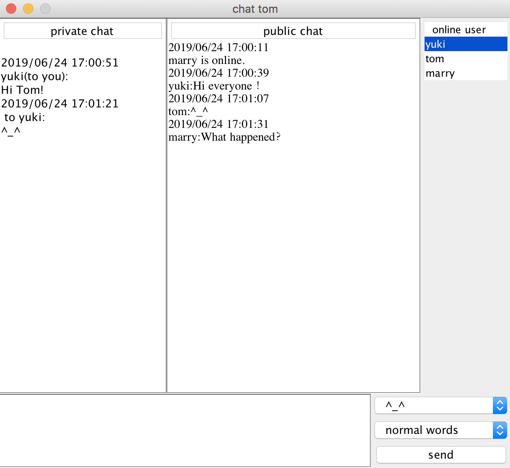
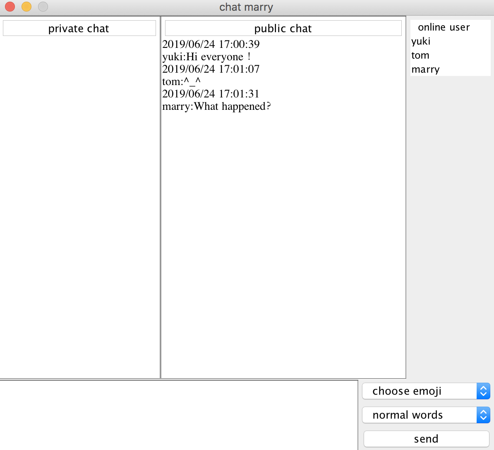

## Java Chatroom

A small java chatroom built with JFrame and Socket.

### Login:

### Register:

### User status and message management:

### Public and private chat:

### Chat message quick choose:

